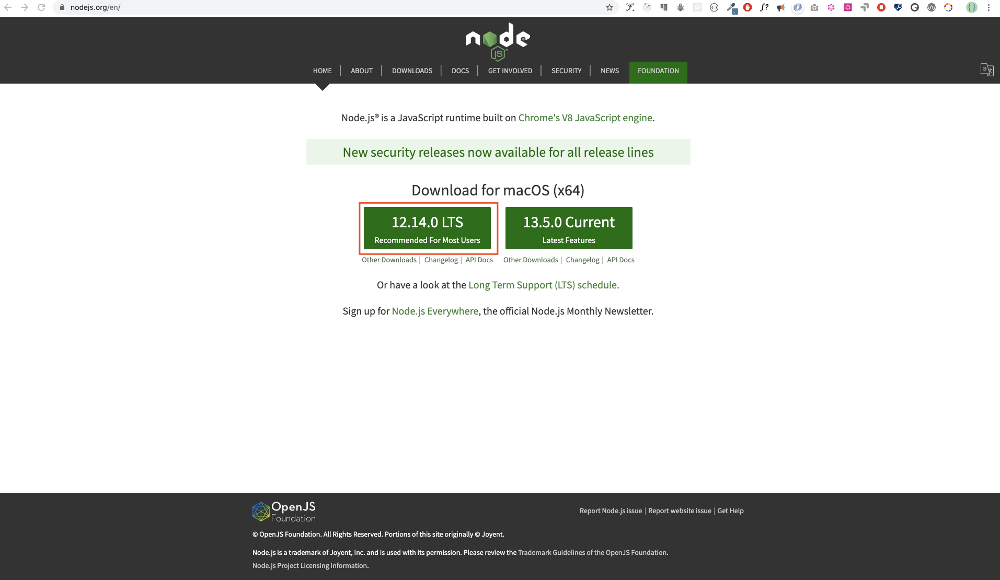

# 30 天学习 JavaScript：简介

## 第一天

### 简介

祝贺你决定参与 30 天学习 JavaScript 编程的挑战。在这个挑战中，你将会学到一切你在使用 JavaScript 编程中所需要的知识，更一般地说，了解整个编程的概念。在挑战的最后，你会获得“30 天学习 JavaScript” 编程挑战的结业证书。如果你需要帮助或者你想帮助别人，你可以加入 [telegram group](https://t.me/ThirtyDaysOfJavaScript)。

30 天学习 JavaScript 挑战是对 JavaScript 新手和高级开发者的一份指导。欢迎来到 JavaScript 世界。JavaScript 是一种网络语言。我很喜欢使用和教授 JavaScript，希望你也能。

在这个手把手教学 JavaScript 的挑战中，你将会学习 JavaScript--人类历史上最受欢迎的编程语言。JavaScript 被用于交互式网站，开发移动 app，桌面应用，游戏，以及今天 JavaScript 甚至还用于 机器学习和 AI。近年来，JavaScript（JS）的流行程度越来越受欢迎，并且是连续六年的领先编程语言，并且是 GitHub 上最常用的编程语言。

### 要求

这个挑战没有编程基础知识的要求，你仅仅需要：

1. 动机
2. 一台电脑
3. 网络
4. 浏览器
5. 代码编辑器

### 安装

我相信你有动机和强烈的欲望去成为一名开发者，也有一台电脑和网络。如果你有这些，那就万事俱备了。

#### 安装 Node.js

你可能现在不需要 Node.js，但稍后你会需要的。[node.js](https://nodejs.org/en/)



下载好以后，双击安装：


我们可以检测 node 是否已安装在本地机器上，打开终端，键入以下命令；

```
node -v
v12.14.0
```

在编写这个教程时我用的 node 是 v12.14.0 版本，但现在的推荐版本是 v14.17.6。

> 翻译时，推荐版本时 v16.14.0.

#### 浏览器

如果你还没有一个浏览器，那就安装谷歌浏览器（[Google Chrome](https://www.google.com/chrome/)）。我们可以在浏览器控制台写一点简单的 JavaScript 代码，但是我们不能用浏览器控制台去开发应用。


##### 打开谷歌浏览器控制台

你可以通过点击浏览器右上角的三点，选择“更多工具 -> 开发者工具” 来打开谷歌浏览器控制台，或者使用快捷键。我偏爱使用快捷键。


打开谷歌浏览器控制台的快捷键：

```sh
# Mac
Command + Option + J

# Windows/Linux
Ctl + Shift + J
```


> `Ctl + Shift + i`，也可以，事实上，我的设备显示的快捷键就是这个。

在你打开谷歌浏览器控制台以后，尝试探索标签按钮。我们会花很多时间在控制台的。控制台是你运行 JavaScript 代码的地方。谷歌浏览器使用 V8 引擎将你的代码编译为机器码。让我们在控制台写点代码试试。


##### 在浏览器控制台写代码

我们可以在谷歌浏览器或任意其他浏览器的控制台写任何 JavaScript 代码。然而，在这个挑战里，我们仅仅聚焦于谷歌浏览器的控制台。打开控制台使用以下命令：

```she
Mac
Command+Option+I

Windows:
Ctl+Shift+I
```

###### `Console.log`

我们使用 JavaScript 内置的 `console.log` 函数来实现第一行代码。通过传入参数作为输入的数据，让函数输出结果。将 “Hello, World” 作为输入数据或参数，传递给 `console.log` 函数。

```js
console.log('Hello, World!');
```

###### `Console.log` 与多个参数

`console.log` 函数可以接受多个用逗号隔开的参数。语法看起来是这个样子：`console.log(param1, param2, param3)`。


```js
console.log('Hello', 'World', '!')
console.log('HAPPY', 'NEW', 'YEAR', 2020)
console.log('Welcome', 'to', 30, 'Days', 'Of', 'JavaScript')
```

如你看到以上代码片段所示，`console.log` 可以接收多个参数。

祝贺，你已经用 `console.log` 写下了你的第一个 JavaScript 代码。

##### 注释

我们给代码添加注释。注释让代码更具可读性，这一点很重要，并且还可以在代码中留下我们的评论。 JavaScript 不会执行注释部分的代码。在 JavaScript 中，任何以 `//` 为开始的文本行都是注释，并且任何像这样以 `/* */` 包裹起来的也是注释。

例子：单行注释

```js
// 这是第一行注释
// 这是第二行注释
// 我是单行注释
```

例子：多行注释

```js
/*
这是多行注释
 多行注释可以占据多行
 JavaScript 是一种互联网语言
 */
```

##### 语法

编程语言很像人类语言。英语或许多其他语言都使用单词，短语，句子，复合句子等来传达有意义的消息。英语的语法意思是单词和短语的排序，以便在语言中创造良好的句子。语法的技术定义是计算机语言中的语句结构。编程语言有语法。JavaScript 是编程语言，和其他编程语言一样有自己的语法。如果我们写出 JavaScript 不能“理解”的语法，那么 JavaScript 将会产生不同类型的错误。稍后我们将会探究 JavaScript 不同类型的错误。现在，让我们看看语法错误吧。


我故意制造了一个错误，因此，控制台提示了语法错误。实际上，语法非常有用。它能告诉你产生了哪种类型的错误。通过阅读错误反馈机制，我们能纠正语法，修复问题。在编程中确定和移除错误的过程被称为调试（debugger）。让我们修复以下错误：

```js
console.log('Hello, World!')
console.log('Hello, World!')
```

到目前为止，我们看到如何使用 `console.log()` 显示文字。如果我们要使用 `console.log()` 打印文字或字符串，那么文字必须要放到单引号，双引号或者反引号（``）中。

```js
console.log('Hello, World!')
console.log("Hello, World!")
console.log(`Hello, World!`)
```

##### 算术

现在，让我们在谷歌浏览器控制台上，使用 `console.log` 来编写更多针对数值类型的 JavaScript 代码。
